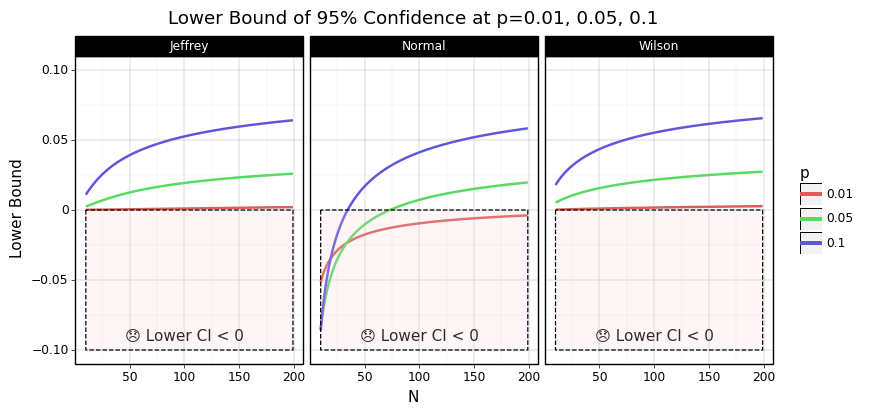

# Binoculars: Binomial Confidence Intervals




[](https://codecov.io/gh/nolanbconaway/binoculars)
[](https://pypi.org/project/binoculars/)


This is a small package that provides functions to compute the confidence interval for a binomial proportion. I made it because I spend altogether too much time staring at the Binomial proportion confidence interval [wiki page](https://en.wikipedia.org/wiki/Binomial_proportion_confidence_interval).

Presently, the package implements:

- [The Normal Approximation](https://en.wikipedia.org/wiki/Binomial_proportion_confidence_interval#Normal_approximation_interval)
- [The Wilson Interval](https://en.wikipedia.org/wiki/Binomial_proportion_confidence_interval#Wilson_score_interval) (no continuity correction)
- [Jeffrey's interval](https://en.wikipedia.org/wiki/Binomial_proportion_confidence_interval#Jeffreys_interval) (via scipy.stats.beta)
- [Clopper-Pearson interval](https://en.wikipedia.org/wiki/Binomial_proportion_confidence_interval#Clopper%E2%80%93Pearson_interval) (also via scipy.stats.beta)

If you haven't spent a lot of time thinking about which interval _you_ should use (and why would you want to?), I suggest using the Wilson interval or Jeffrey's interval. Jeffrey's interval is returned by default by the `binomial_confidence` function in this package. 

> You _oughtn't_ use the normal approximation if you don't have to. It produces patently inaccurate values with low/high probabilities at low Ns. The plot at the top of this readme shows the normal approximation producing lower lower bounds of _less than 0_ in these cases.

## Install

```sh
pip install binoculars
```

## Usage

```py
from binoculars import binomial_confidence

N, p = 100, 0.2

binomial_confidence(p, N)  # default to jeffrey's interval
# (0.1307892803998113, 0.28628125447599173)

binomial_confidence(p, N, tail='lower') # grab one tail
# 0.1307892803998113

# set Z value
binomial_confidence(p, N, tail='lower', z=2.58)
# 0.11212431621448567

# choose your method

binomial_confidence(p, N, method='normal')
# (0.12160000000000001, 0.2784)

binomial_confidence(p, N, method='wilson')
# (0.1333659225590988, 0.28883096192650237)
```

## Development

I honestly do not imagine touching this a lot. But maybe you want to add one of the other interval methods?

1. Make a python 3.6+ venv
3. `pip install -e .[test]`
4. `black lib --check`
5. `pytest`

## Later (?)

 - [ ] Add confidence intervals for odds ratios, differences
 - [ ] Add the unimplemented intervals
 - [x] Add plots comparing the intervals to readme.
